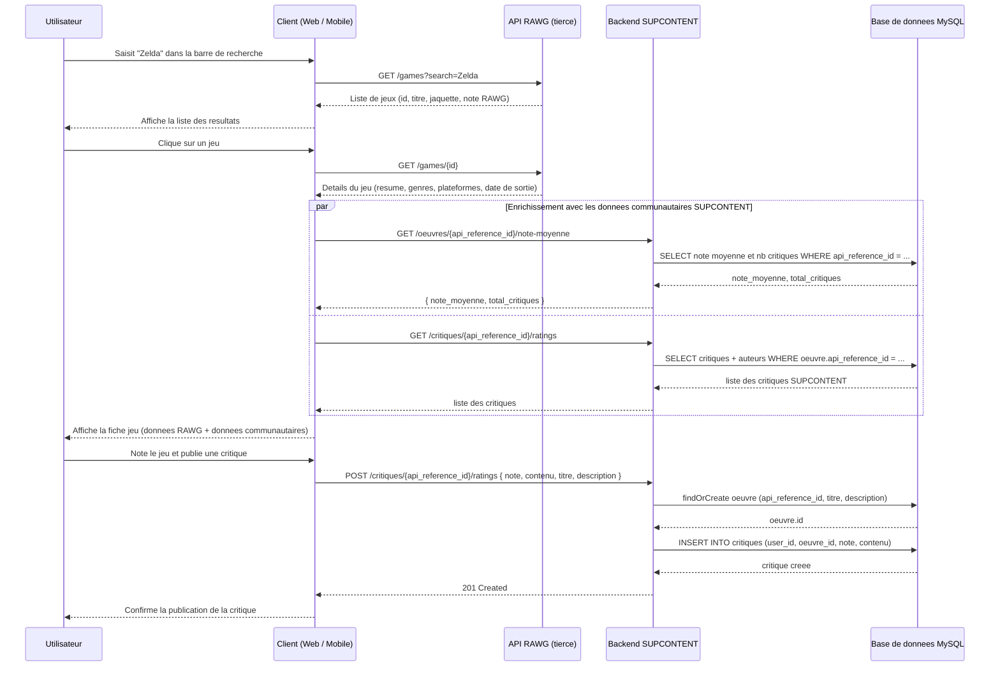
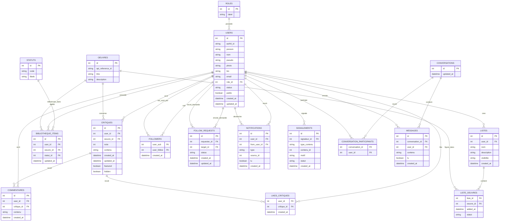

# Diagrammes UML — SUPCONTENT

Ce document contient les diagrammes UML de la documentation technique :

1. [Diagramme de cas d'utilisation](#1-diagramme-de-cas-dutilisation)
2. [Diagramme de séquence — Recherche et consultation d'une fiche jeu (intégration RAWG)](#2-diagramme-de-séquence--recherche-et-consultation-dune-fiche-jeu-intégration-rawg)
3. [Modèle de données (diagramme entité-association)](#3-modèle-de-données-diagramme-entité-association)

Les diagrammes sont écrits au format [Mermaid](https://mermaid.js.org/) : ils se rendent automatiquement dans GitHub, GitLab et VS Code (extension *Markdown Preview Mermaid Support*).

---

## 1. Diagramme de cas d'utilisation

Quatre profils d'acteurs sont gérés par l'application : **Visiteur** (non authentifié), **Utilisateur** (compte créé via Auth0), **Modérateur** et **Administrateur**. Chaque rôle hérite des droits du rôle précédent.

---

## 2. Diagramme de séquence — Recherche et consultation d'une fiche jeu (intégration RAWG)

Ce diagramme illustre l'interaction entre le client (web ou mobile), l'API tierce **RAWG** et le backend **SUPCONTENT** lors d'une recherche, de la consultation d'une fiche jeu, puis de la publication d'une critique.

---

## 3. Modèle de données (diagramme entité-association)

Reflète le schéma MySQL réel (`backend/config/schema.sql`).

