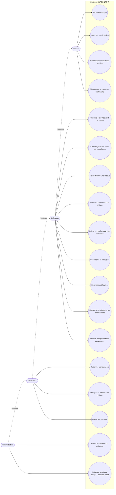

# Diagrammes UML — SUPCONTENT

Ce document contient les diagrammes UML de la documentation technique :

1. [Diagramme de cas d'utilisation](#1-diagramme-de-cas-dutilisation)

Les diagrammes sont écrits au format [Mermaid](https://mermaid.js.org/) : ils se rendent automatiquement dans GitHub, GitLab et VS Code (extension *Markdown Preview Mermaid Support*).

---

## 1. Diagramme de cas d'utilisation

Quatre profils d'acteurs sont gérés par l'application : **Visiteur** (non authentifié), **Utilisateur** (compte créé via Auth0), **Modérateur** et **Administrateur**. Chaque rôle hérite des droits du rôle précédent.

